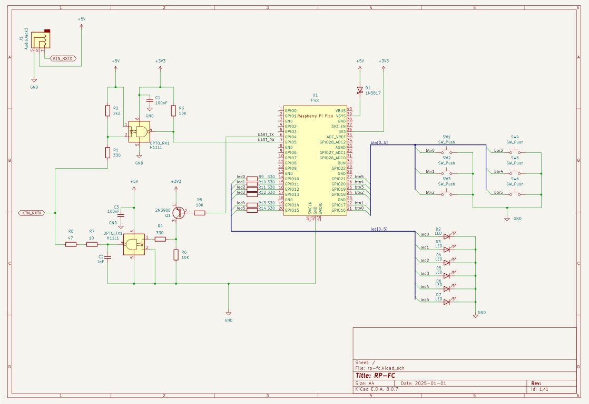

# RP-FC

RP2040 Foot Controller. A Boss GA-FC foot controller replacement for Boss Katana Gen3 amps.

## About

This project acts as a GA-FC-compatible footswitch for Boss Katana Gen3 amps. A RP2040 microcontroller, e.g. a Raspberry Pi Pico, implements the serial communication with the amp. A simple circuit with a couple of optocouplers is required around the RP2040 (source for that [here](https://www.vguitarforums.com/smf/index.php?topic=19959.msg166947#msg166947)). This new foot controller connects to the amp with a single TRS cable, and gets powered with that same cable.

This has only been tested with Katana 100 Gen3. I know there are differences in the GA-FC communication between Gen 3 and the previous versions of the amps, so I don't know if this works with those or not.

Try at your own risk.

## Hardware

See the required parts in the schematic drawing.

## Build firmware

This project is implemented with embedded Rust, mainly around the [rp-hal](https://github.com/rp-rs/rp-hal) crate. To build the project, a Rust toolchain is needed.

1. Install prerequisite packages
    - [flip-link](https://github.com/knurling-rs/flip-link)
    - [probe-rs](https://probe.rs/)
2. Setup the ARM toolchain with rustup
        
        rustup target add thumbv6m-none-eabi

3. Build: `cargo build`
4. Flash and tail logs with probe-rs: `cargo run`
    - See probe-rs docs for more information about configuration and connections